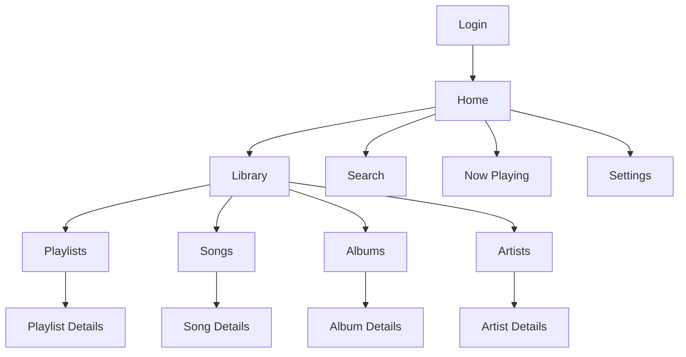

# Mobile App Design Document: Korus Client (Jetpack Compose)

This design document provides a comprehensive blueprint for building a modern Android music streaming client for the Korus backend. The architecture leverages Jetpack Compose for declarative UI, a refined data layer with a single source of truth, a decoupled service-based player, and robust background operations, ensuring excellent performance, security, and user experience.


## Korus Server Integration

### Source Code Locations
- **Korus Server Source**: `/home/aun/Programming/Projects/WebProjects/korus`
- **API Documentation**: `/home/aun/Programming/Projects/WebProjects/korus/API.md`
- **Server Design Document**: `/home/aun/Programming/Projects/WebProjects/korus/DESIGN.md`
- **Server README**: `/home/aun/Programming/Projects/WebProjects/korus/README.md`

YOU MUST TRACK YOUR PROGRESS IN PROGRESS.md

### Server Architecture Reference
The Korus server is a Go-based application with the following structure:
```
/home/aun/Programming/Projects/WebProjects/korus/
├── cmd/korus/main.go           # Application entry point
├── internal/
│   ├── handlers/               # HTTP request handlers
│   │   ├── auth.go            # Authentication endpoints
│   │   ├── library.go         # Library management
│   │   ├── playlist.go        # Playlist operations
│   │   ├── history.go         # Listening history
│   │   └── user_library.go    # User-specific library features
│   ├── services/              # Business logic layer
│   ├── middleware/            # HTTP middleware (auth, CORS, etc.)
│   ├── database/              # PostgreSQL integration
│   └── streaming/             # Audio streaming logic
├── migrations/                # Database schema migrations
└── docker-compose.yml         # Development setup
```

## 1. App Architecture

### MVVM with Clean Architecture
The application follows the MVVM (Model-View-ViewModel) pattern combined with the principles of Clean Architecture to separate concerns into distinct layers.

```
┌─────────────────────────────────────────────────────────────┐
│                    Presentation Layer                        │
│  ┌───────────────┐ ┌───────────────┐ ┌───────────────────┐   │
│  │   Composable  │ │   ViewModel   │ │   Navigation      │   │
│  │     UI        │ │(State, Events)│ │   Component       │   │
│  └───────────────┘ └───────────────┘ └───────────────────┘   │
└─────────────────────────────────────────────────────────────┘
                              │
                              ▼
┌─────────────────────────────────────────────────────────────┐
│                      Domain Layer                            │
│  ┌───────────────┐ ┌───────────────┐ ┌───────────────────┐   │
│  │   Use Cases   │ │   Models      │ │   Repository      │   │
│  │  (Interactors)│ │   (Entities)  │ │   Interfaces      │   │
│  └───────────────┘ └───────────────┘ └───────────────────┘   │
└─────────────────────────────────────────────────────────────┘
                              │
                              ▼
┌─────────────────────────────────────────────────────────────┐
│                       Data Layer                             │
│  ┌───────────────┐ ┌───────────────┐ ┌───────────────────┐   │
│  │   Remote DS   │ │   Local DS    │ │   Repository      │   │
│  │   (Retrofit)  │ │   (Room DB)   │ │   Impl. (SSOT)    │   │
│  └───────────────┘ └───────────────┘ └───────────────────┘   │
└─────────────────────────────────────────────────────────────┘
```

### Key Components & Technologies
- **UI**: Jetpack Compose with Material 3
- **State Management**: ViewModel + StateFlow
- **Navigation**: Navigation Compose with type-safe arguments
- **DI**: Koin for modular dependency injection
- **Database**: Room with SQLite as the Single Source of Truth (SSOT)
- **Networking**: Retrofit with OkHttp, `Authenticator` for token refresh
- **Background Sync**: WorkManager for periodic data synchronization
- **Media Playback**: ExoPlayer managed within a Foreground Service
- **Media Caching**: ExoPlayer's `CacheDataSource` for seamless offline playback
- **Security**: EncryptedSharedPreferences for tokens, Certificate Pinning
- **Image Loading**: Coil for efficient image loading and caching

### Component Interaction Diagram
This diagram illustrates the flow of data and control between the major refined components.
```mermaid
graph TD
    A[UI Layer (Composables, ViewModels)] -->|Observes & sends commands| M[PlayerServiceConnection]
    M -->|Binds to & communicates with| K[MusicService]
    K -->|Hosts| H[PlayerManager]
    H -->|Manages| I[ExoPlayer]
    H -->|Fetches song details| B[Data Layer - Room]
    I -->|Streams/Plays from| J[CacheDataSource]

    A -->|Observes| B[Data Layer - Room]
    A -->|Triggers sync via ViewModel| C[SyncManager]

    C[SyncManager] -->|Executes explicit sync| D[Network Layer - Retrofit]
    L[WorkManager] -->|Triggers periodic sync| C

    D -->|Makes API call| E[Korus API]
    E -->|401 Unauthorized| D
    D -->|Triggers Authenticator| F[TokenAuthenticator]
    F -->|Uses| G[TokenManager]
    G -->|Refreshes token via API| D
    D -->|Writes data to| B
```

## 2. UI/UX Design

### Navigation Structure


### Screen Definitions
| Screen | Key Components | State Management |
|--------|----------------|------------------|
| **Login** | LoginForm, ForgotPassword | LoginViewModel |
| **Home** | HomeSections (RecentlyAdded, RecentlyPlayed, etc.) | HomeViewModel |
| **Library** | TabRow (Songs, Albums, Artists, Playlists) | LibraryViewModel |
| **Search** | SearchBar, SearchResults | SearchViewModel |
| **Now Playing** | PlayerControls, Queue, Lyrics | PlayerViewModel (interacts with PlayerManager) |
| **Playlist Details** | SongList, ReorderableList | PlaylistViewModel |
| **Settings** | PreferenceScreen, AccountSettings | SettingsViewModel |

### Theme System
A standard Material 3 theme is used, supporting both light and dark modes based on the system theme.
```kotlin
// Theme.kt
@Composable
fun KorusTheme(
    darkTheme: Boolean = isSystemInDarkTheme(),
    content: @Composable () -> Unit
) {
    val colorScheme = if (darkTheme) DarkColorScheme else LightColorScheme
    
    MaterialTheme(
        colorScheme = colorScheme,
        typography = Typography,
        shapes = Shapes,
        content = content
    )
}
```

## 3. Data Layer Implementation

The data layer is built on the Single Source of Truth (SSOT) principle, where the Room database is the sole authority for app data. UI layers observe data from the database, and network operations are explicitly triggered to update the database.

### Network Layer (Retrofit)
```kotlin
// KorusApiService.kt
interface KorusApiService {
    @POST("auth/login")
    suspend fun login(@Body request: LoginRequest): LoginResponse

    @POST("auth/refresh")
    suspend fun refreshToken(@Body request: RefreshTokenRequest): RefreshTokenResponse
    
    @GET("me/home")
    suspend fun getHomeSections(/*...args...*/): HomeSectionsResponse
    
    @GET("songs")
    suspend fun getSongs(): List<Song>

    // ... other endpoints
}
```

### Local Database (Room)
```kotlin
// Database.kt
@Database(
    entities = [ SongEntity::class, AlbumEntity::class, /* ...other entities */ ],
    version = 1
)
@TypeConverters(Converters::class)
abstract class KorusDatabase : RoomDatabase() {
    abstract fun songDao(): SongDao
    // ... other DAOs
}

// SongEntity.kt
@Entity(tableName = "songs")
data class SongEntity(
    @PrimaryKey val id: String,
    val title: String,
    val albumId: String,
    // ... other fields
)
```

### Repository (Single Source of Truth)
```kotlin
// SongRepository.kt
class SongRepositoryImpl(
    private val apiService: KorusApiService,
    private val database: KorusDatabase,
    @IoDispatcher private val ioDispatcher: CoroutineDispatcher
) : SongRepository {
    
    // UI only observes data from the database (SSOT).
    override fun getSongs(): Flow<List<Song>> = 
        database.songDao().getAllSongs()
            .map { entities -> entities.map { it.toSong() } }
            .flowOn(ioDispatcher)
            
    // Network operations are explicit and update the database.
    override suspend fun syncSongs() {
        withContext(ioDispatcher) {
            try {
                val remoteSongs = apiService.getSongs()
                database.withTransaction {
                    database.songDao().deleteAllSongs()
                    database.songDao().insertAll(remoteSongs.map { it.toEntity() })
                }
            } catch (e: Exception) {
                // Log error but don't throw - UI will show existing cached data.
            }
        }
    }
    
    override suspend fun getSong(songId: String): Song? =
        database.songDao().getSongById(songId)?.toSong()
}
```

## 4. Offline Support & Caching

### Data Syncing with WorkManager
A `SyncManager` coordinates data synchronization, which can be triggered on-demand or periodically by a `SyncWorker` managed by WorkManager.

```kotlin
// SyncManager.kt
class SyncManager(
    private val songRepository: SongRepository,
    private val playlistRepository: PlaylistRepository,
    private val workManager: WorkManager,
    private val connectivityManager: ConnectivityManager
) {
    suspend fun syncAll() {
        if (isOnline()) {
            coroutineScope {
                launch { songRepository.syncSongs() }
                launch { playlistRepository.syncPlaylists() }
            }
        }
    }
    
    fun schedulePeriodicSync() {
        val constraints = Constraints.Builder()
            .setRequiredNetworkType(NetworkType.CONNECTED)
            .setRequiresBatteryNotLow(true)
            .build()
        
        val syncRequest = PeriodicWorkRequestBuilder<SyncWorker>(12, TimeUnit.HOURS)
            .setConstraints(constraints)
            .build()
        
        workManager.enqueueUniquePeriodicWork(
            "periodic_sync",
            ExistingPeriodicWorkPolicy.KEEP,
            syncRequest
        )
    }
    // ...
}

// SyncWorker.kt
class SyncWorker(context: Context, params: WorkerParameters) : CoroutineWorker(context, params) {
    override suspend fun doWork(): Result {
        val syncManager by inject<SyncManager>()
        return try {
            syncManager.syncAll()
            Result.success()
        } catch (e: Exception) {
            Result.retry()
        }
    }
}
```

### Media Caching with ExoPlayer
Instead of a manual `DownloadManager`, media is cached automatically during streaming using ExoPlayer's `CacheDataSource`. This provides seamless offline playback for any content that has been previously streamed.

```kotlin
// CacheModule.kt in DI
val cacheModule = module {
    single {
        val context = androidApplication()
        val downloadCache = SimpleCache(
            File(context.cacheDir, "media_cache"),
            LeastRecentlyUsedCacheEvictor(512 * 1024 * 1024), // 512MB cache
            DatabaseProvider(context)
        )
        
        DefaultDataSource.Factory(
            context,
            DefaultHttpDataSource.Factory(),
            CacheDataSource.Factory()
                .setCache(downloadCache)
                .setUpstreamDataSourceFactory(DefaultHttpDataSource.Factory())
                .setCacheWriteDataSinkFactory(null) // Caches on read
        )
    }
    
    single {
        ExoPlayer.Builder(androidApplication())
            .setMediaSourceFactory(DefaultMediaSourceFactory(get()))
            .setAudioAttributes(AudioAttributes.DEFAULT, true)
            // ... other configurations
            .build()
    }
}
```

## 5. Decoupled Music Player Architecture

Music playback is managed by a `Foreground Service` to ensure it continues when the app is in the background. A `PlayerManager` abstracts all ExoPlayer logic, and the UI communicates with it via a `PlayerServiceConnection`.

### Player Service (`MusicService.kt`)
```kotlin
class MusicService : Service() {
    @Inject lateinit var playerManager: PlayerManager
    @Inject lateinit var notificationManager: PlayerNotificationManager
    
    override fun onCreate() {
        super.onCreate()
        startForeground(NOTIFICATION_ID, notificationManager.createNotification())
        playerManager.initialize()
    }
    
    override fun onBind(intent: Intent?): IBinder = MusicBinder()
    
    inner class MusicBinder : Binder() {
        val playerManager: PlayerManager get() = this@MusicService.playerManager
    }
    
    // ... onDestroy, companion object
}
```

### Player Manager Abstraction
This class centralizes all playback logic, making it testable and decoupled from the UI.
```kotlin
interface PlayerManager {
    val playerState: StateFlow<PlayerState>
    fun playSong(songId: String)
    fun setQueue(songs: List<Song>, startIndex: Int)
    fun togglePlayPause()
    // ... other control methods
    fun release()
    fun initialize()
}

class PlayerManagerImpl(
    private val exoPlayer: ExoPlayer,
    private val songRepository: SongRepository
) : PlayerManager {
    private val _playerState = MutableStateFlow(PlayerState())
    override val playerState: StateFlow<PlayerState> = _playerState.asStateFlow()

    override fun playSong(songId: String) {
        viewModelScope.launch {
            songRepository.getSong(songId)?.let { song ->
                val mediaItem = // ... build MediaItem from song
                exoPlayer.setMediaItem(mediaItem)
                exoPlayer.prepare()
                exoPlayer.playWhenReady = true
            }
        }
    }
    // ... other implementations
}
```

### UI-Service Communication
```kotlin
// PlayerServiceConnection.kt
class PlayerServiceConnection(private val context: Context) {
    val playerState: StateFlow<PlayerState> //...
    
    private val serviceConnection = object : ServiceConnection {
        override fun onServiceConnected(name: ComponentName, service: IBinder) {
            val binder = service as MusicService.MusicBinder
            // Start collecting state from the PlayerManager
        }
        // ...
    }

    fun bind() {
        // Bind to MusicService
    }
}
```

## 6. Authentication & Security

### Asynchronous Token Refresh with Authenticator
An OkHttp `Authenticator` automatically handles `401 Unauthorized` responses by refreshing the access token, preventing API call failures and UI freezes.

```kotlin
// TokenAuthenticator.kt
class TokenAuthenticator(
    private val tokenManager: TokenManager,
    @IoDispatcher private val ioDispatcher: CoroutineDispatcher
) : Authenticator {
    override fun authenticate(route: Route?, response: Response): Request? {
        return runBlocking(ioDispatcher) {
            val newToken = tokenManager.refreshToken()
            if (newToken != null) {
                response.request.newBuilder()
                    .header("Authorization", "Bearer $newToken")
                    .build()
            } else {
                tokenManager.clearTokens() // Refresh failed, log out
                null
            }
        }
    }
}

// AuthInterceptor.kt - Still needed to add the initial token
class AuthInterceptor(private val tokenManager: TokenManager) : Interceptor {
    override fun intercept(chain: Interceptor.Chain): Response {
        val token = runBlocking { tokenManager.getAccessToken().first() }
        val request = chain.request().newBuilder()
            .addHeader("Authorization", "Bearer $token")
            .build()
        return chain.proceed(request)
    }
}
```

### Token Management
The `TokenManager` uses AndroidX Security's `EncryptedSharedPreferences` to securely store tokens.
```kotlin
class TokenManager(private val apiService: KorusApiService, private val dataStore: DataStore<Preferences>) {
    val accessToken: Flow<String?> = dataStore.data.map { it[ACCESS_TOKEN_KEY] }

    suspend fun refreshToken(): String? {
        val refreshToken = dataStore.data.first()[REFRESH_TOKEN_KEY] ?: return null
        return try {
            val response = apiService.refreshToken(RefreshTokenRequest(refreshToken))
            saveTokens(response.accessToken, response.refreshToken)
            response.accessToken
        } catch (e: Exception) {
            clearTokens()
            null
        }
    }

    suspend fun saveTokens(accessToken: String, refreshToken: String) { /* ... */ }
    suspend fun clearTokens() { /* ... */ }
}
```

### Certificate Pinning
To prevent man-in-the-middle attacks, certificate pinning is enforced on the production server.
```kotlin
// In OkHttpClient setup
fun OkHttpClient.Builder.addCertificatePinning(): OkHttpClient.Builder {
    val certificatePinner = CertificatePinner.Builder()
        .add("your-korus-server.com", "sha256/...")
        .build()
    return this.certificatePinner(certificatePinner)
}
```

## 7. Dependency Injection (Koin)

Koin modules provide all necessary dependencies for the application.

```kotlin
// NetworkModule.kt
val networkModule = module {
    single { TokenAuthenticator(get(), Dispatchers.IO) }
    single { TokenManager(get(), get()) }
    single {
        OkHttpClient.Builder()
            .addInterceptor(AuthInterceptor(get()))
            .authenticator(get<TokenAuthenticator>())
            .addCertificatePinning()
            // ... other interceptors
            .build()
    }
    single<KorusApiService> {
        Retrofit.Builder()
            .baseUrl("...")
            .client(get())
            .addConverterFactory(...)
            .build()
            .create(KorusApiService::class.java)
    }
}

// RepositoryModule.kt
val repositoryModule = module {
    single<SongRepository> { SongRepositoryImpl(get(), get(), Dispatchers.IO) }
    // ... other repositories
}

// PlayerModule.kt
val playerModule = module {
    single { // ExoPlayer instance from CacheModule }
    single<PlayerManager> { PlayerManagerImpl(get(), get()) }
    single { PlayerServiceConnection(androidContext()) }
}

// ViewModelModule.kt
val viewModelModule = module {
    viewModel { HomeViewModel(get()) }
    viewModel { PlayerViewModel(get()) } // Injects PlayerManager
    // ... other ViewModels
}

// AppModules.kt - The complete list of modules
val appModules = listOf(networkModule, databaseModule, repositoryModule, playerModule, cacheModule, viewModelModule, ...)
```

## 8. Key Features Implementation Snippets

### Authentication Flow
The `LoginViewModel` and `LoginScreen` remain structurally similar, but the underlying repository and token management are now more robust.
```kotlin
// LoginViewModel.kt
fun login(username: String, password: String) {
    viewModelScope.launch {
        _loginState.value = LoginState.Loading
        try {
            val response = authRepository.login(username, password)
            // The new TokenManager handles saving
            tokenManager.saveTokens(response.accessToken, response.refreshToken)
            _loginState.value = LoginState.Success
        } catch (e: Exception) {
            _loginState.value = LoginState.Error("Login failed")
        }
    }
}
```

### Playlist Reordering
This feature remains unchanged, as it depends on standard ViewModel-Repository-UI interaction.
```kotlin
// PlaylistDetailViewModel.kt
class PlaylistDetailViewModel(
    private val playlistId: String,
    private val playlistRepository: PlaylistRepository
) : ViewModel() {
    private val _songs = mutableStateListOf<Song>()
    val songs: List<Song> = _songs

    fun reorderSongs(fromIndex: Int, toIndex: Int) {
        // Optimistically update UI
        val song = _songs.removeAt(fromIndex)
        _songs.add(toIndex, song)
        
        // Persist change to backend
        viewModelScope.launch {
            playlistRepository.reorderPlaylist(playlistId, _songs.map { it.id })
        }
    }
}
```

## 9. Performance Optimization

- **Image Loading**: Coil is configured with memory and disk caches to optimize image loading performance.
  ```kotlin
  single<ImageLoader> {
      ImageLoader.Builder(get())
          .crossfade(true)
          .memoryCache { MemoryCache.Builder(get()).maxSizePercent(0.25).build() }
          .diskCache { /* 50MB disk cache */ }
          .build()
  }
  ```
- **Database Optimization**: Room queries are executed on background threads. Slow query logging can be enabled for debugging.
- **Battery Efficiency**: The combination of WorkManager with constraints, a Foreground Service for playback, and ExoPlayer's caching minimizes network usage and CPU wake-ups, leading to better battery life.
- **Network Optimization**: The `Authenticator` avoids redundant token checks, and media caching significantly reduces data consumption on repeated plays.

## 10. Testing Strategy

The decoupled architecture enhances testability.

### Unit Testing (Repository, Manager, Authenticator)
```kotlin
// SongRepositoryTest.kt
@Test
fun `syncSongs updates database on network success`() = runTest {
    // Given a mocked API service that returns songs
    // and a mocked DAO
    val repository = SongRepositoryImpl(mockApi, mockDatabase, testDispatcher)
    
    // When
    repository.syncSongs()
    
    // Then
    coVerify { mockDao.deleteAllSongs() }
    coVerify { mockDao.insertAll(...) }
}

// PlayerManagerTest.kt
@Test
fun `playSong sets media item and prepares player`() = runTest {
    // Given a mocked ExoPlayer and repository
    val manager = PlayerManagerImpl(mockPlayer, mockRepo)
    manager.initialize()

    // When
    manager.playSong("song1")

    // Then
    verify { mockPlayer.setMediaItem(any()) }
    verify { mockPlayer.prepare() }
}
```

### UI Testing
UI tests remain crucial for verifying Composable behavior and interaction with ViewModels.
```kotlin
// LoginScreenTest.kt
class LoginScreenTest {
    @get:Rule val composeTestRule = createComposeRule()
    
    @Test
    fun loginScreen_displaysErrorOnFailedLogin() {
        // Given a ViewModel with an error state
        val viewModel = mockk<LoginViewModel>(relaxed = true)
        every { viewModel.loginState } returns mutableStateOf(LoginState.Error("Invalid credentials"))
        
        // When
        composeTestRule.setContent { LoginScreen(viewModel = viewModel, ...) }
        
        // Then
        composeTestRule.onNodeWithText("Invalid credentials").assertIsDisplayed()
    }
}
```

## 11. Deployment

### Build Configuration
Build variants for `debug` and `release` define different base URLs and enable code shrinking for production builds.
```gradle
// build.gradle.kts (app)
android {
    buildTypes {
        debug {
            applicationIdSuffix = ".debug"
            buildConfigField("String", "BASE_URL", "\"https://dev.korus-server.com/api/\"")
        }
        release {
            isMinifyEnabled = true
            isShrinkResources = true
            proguardFiles(...)
            buildConfigField("String", "BASE_URL", "\"https://korus-server.com/api/\"")
        }
    }
    // ... composeOptions, dependencies
}
```

### ProGuard Rules
Rules are included to ensure that reflection-based libraries like Koin, Retrofit, and Room are not broken by code obfuscation.
```
# Keep Koin, Retrofit, OkHttp, Room, and Serialization classes
-keep class io.insert.koin.** { *; }
-keep class retrofit2.** { *; }
-keep class okhttp3.** { *; }
-keep class * extends androidx.room.RoomDatabase
# ... other rules
```